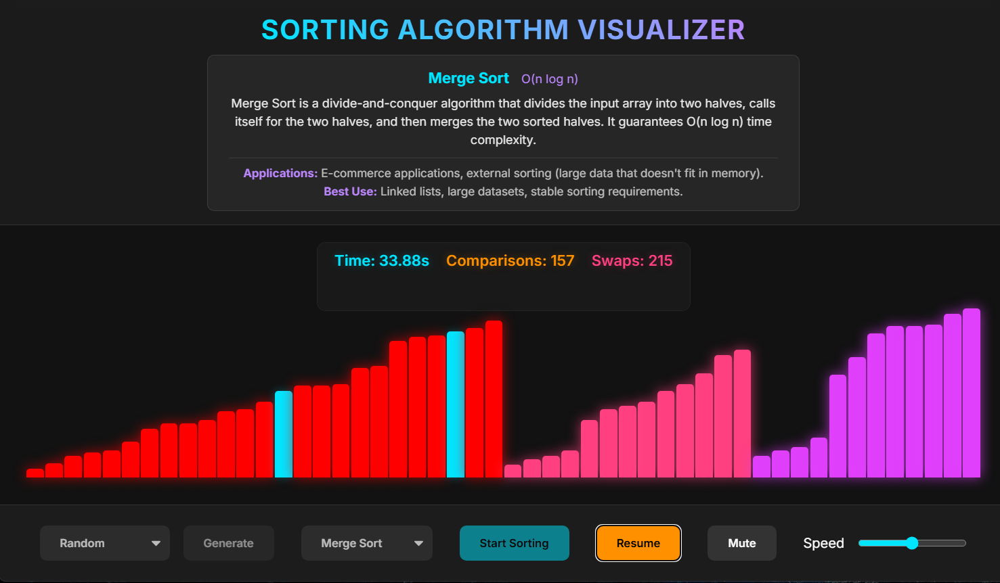

# 🎨 Sorting Algorithm Visualizer


> An interactive web application visualizing sorting algorithms, illustrating their mechanics, time complexities, and performance differences.

🌐 **Live Demo:** [https://kerim-altny.github.io/sorting-visualizer/](https://kerim-altny.github.io/sorting-visualizer/)



## 🎯 About The Project

I developed this project to visualize the theoretical concepts learned in **Data Structures and Algorithms** course .

The goal was not just to write code, but to create a visual and auditory experience that concretizes abstract algorithmic concepts like **Time Complexity**, **Swaps**, and **Comparisons**.

💡 **Development Method:** This project was built using the **"AI-Assisted Vibe Coding"** methodology with **Antigravity**, focusing on architectural logic and rapid prototyping.

## ✨ Features

### 🧮 Supported Algorithms
* **Bubble Sort** $O(n^2)$: Demonstrates basic swapping logic.
* **Selection Sort** $O(n^2)$: Selects the minimum element and places it at the beginning.
* **Insertion Sort** $O(n^2)$: Sorts like arranging playing cards in hand (Efficient for nearly sorted data).
* **Quick Sort** $O(n \log n)$: Visualizes the Pivot logic and Divide & Conquer approach.
* **Merge Sort** $O(n \log n)$: A clean example of the recursive divide-and-conquer strategy.
* **Heap Sort** $O(n \log n)$: Visualization of the Binary Heap data structure.

### ⚙️ Controls & Analytics
* **Data Scenarios:** `Random`, `Reversed` (Worst Case), and `Nearly Sorted` data generation to test algorithm performance.
* **Speed Control:** Adjustable animation speed.
* **Sonification (Sound Effects):** Dynamic audio feedback based on sorting operations (with Mute option).
* **Live Statistics:** Real-time counters for `Comparisons` and `Swaps`.

## 🛠️ Technologies

* **Frontend:** HTML5, CSS3 (Responsive Design), Vanilla JavaScript (ES6+)
* **Tooling:** Git, Cursor (AI Editor)
* **Hosting:** GitHub Pages

## 🚀 Installation (Local)

To run this project locally:

1.  Clone the repository:
    ```bash
    git clone [https://github.com/Kerim-Altny/sorting-visualizer.git](https://github.com/Kerim-Altny/sorting-visualizer.git)
    ```
2.  Navigate to the directory:
    ```bash
    cd sorting-visualizer
    ```
3.  Open `index.html` in your browser. (No extra dependencies or `npm install` required).

---

## 👨‍💻 Developer

**Kerim Altınay** Computer Engineering Student @ Hacettepe University
• [GitHub Profile](https://github.com/Kerim-Altny)
